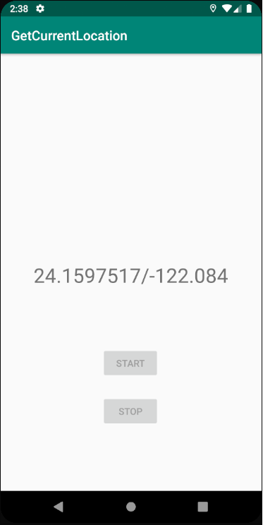

# Get Your Current Location (Kotlin)

This is a project getting your current location on Android Studio using Kotlin programming language 

Getting Started
---------------
This sample uses the Gradle build system. To build this project, use the
"gradlew build" command or use "Import Project" in Android Studio.

